# UBE-PANDAN

Based on EVA01 colors from the Evangelion anime.

## 🛠 Installed Programs

<table>
  <tr>
    <td>
      
| Component         | Program    |
|-------------------|------------|
| Window Manager 🪟| [Hyprland](https://github.com/hyprwm/Hyprland)  |
| Bar 📊            | [Waybar](https://github.com/Alexays/Waybar)      |
| Launcher 🚀       | [Rofi](https://github.com/davatorium/rofi)          |
| Terminal 🖥️       | [Kitty](https://github.com/kovidgoyal/kitty)        |
| File Manager 📁   | [Thunar](https://github.com/dfmgr/Thunar) / [Ranger](https://github.com/ranger/ranger)      |
| System Info 🖼️    | [Neofetch](https://github.com/dylanaraps/neofetch) |
| Wallpaper 🎨      | [swww](https://github.com/LGFae/swww) |
| Screenshot 📸     | [Hyprshot](https://github.com/hyprwm/hyprshot) |
| Visualizer 🎵     | [Cava](https://github.com/karlstav/cava) |
      
    </td>
    <td>
      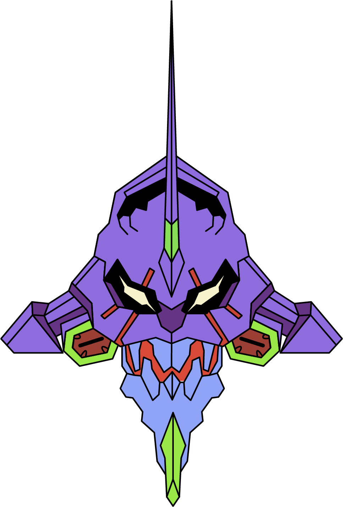
    </td>
  </tr>
</table>

## 🎛 Keybindings

| Keybind | Action |
|---------|--------|
| `SUPER + Q` | Open Terminal |
| `SUPER + C` | Close Active Window |
| `SUPER + M` | Exit Hyprland |
| `SUPER + E` | Open File Manager |
| `SUPER + V` | Toggle Floating Window |
| `SUPER + R` | Open Rofi Launcher |
| `SUPER + P` | Toggle Pseudo-Tiling |
| `SUPER + J` | Toggle Split Mode |
| `SUPER + O` | Open VS Code |
| `SUPER + D` | Open Dolphin File Manager |
| `SUPER + SHIFT + W` | Open Wallpaper Picker |
| `ALT + Tab` | Cycle Through Windows |
| `SUPER + F` | Toggle Fullscreen |
| `SUPER + SHIFT + L` | Lock Screen (Hyprlock) |
| `SUPER + U` | Take Screenshot (Hyprshot) |
| `SUPER + Arrow Keys` | Move Focus Between Windows |
| `SUPER + [1-0]` | Switch Workspaces |
| `SUPER + SHIFT + [1-0]` | Move Window to Workspace |
| `SUPER + S` | Toggle Special Workspace |
| `SUPER + SHIFT + S` | Move Window to Special Workspace |
| `SUPER + Scroll` | Cycle Through Workspaces |
| `SUPER + Left Mouse` | Move Window |
| `SUPER + Right Mouse` | Resize Window |

## 📸 Screenshots

<p align="center">
  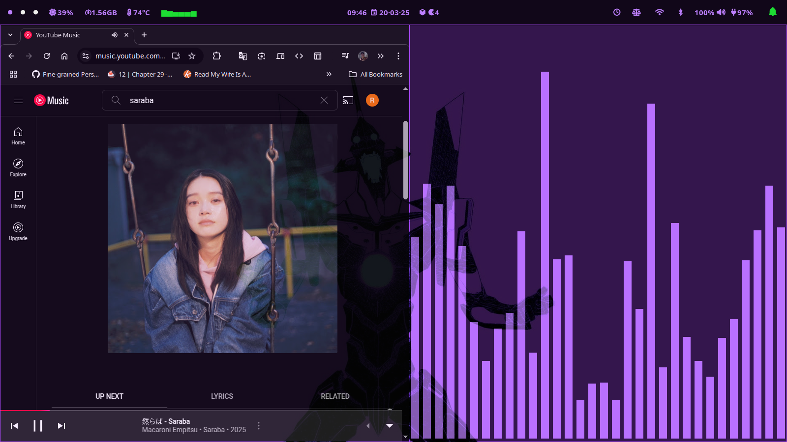
  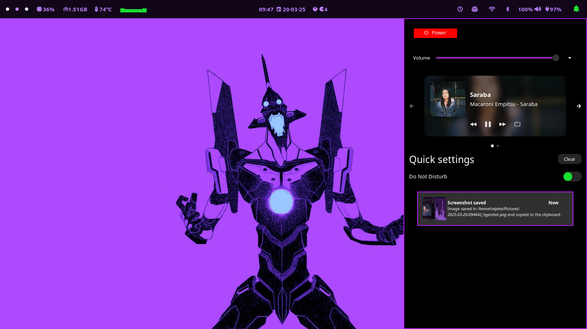
  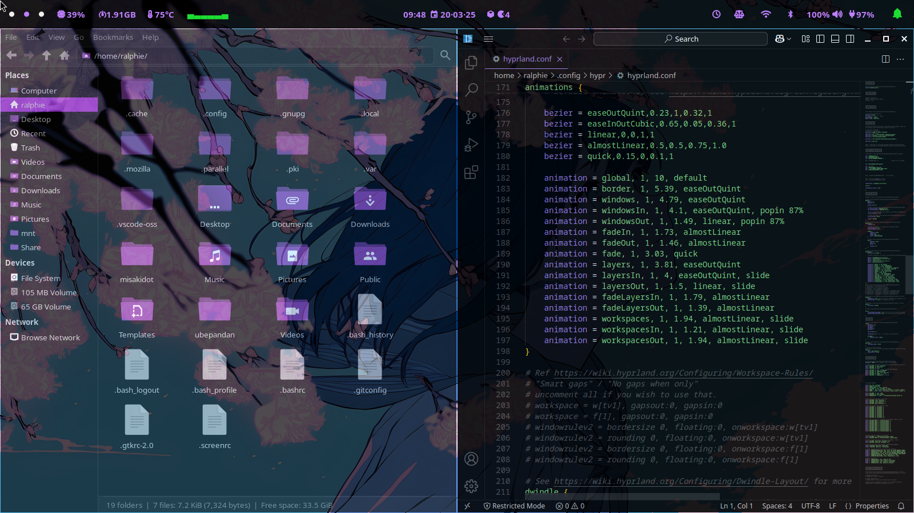
  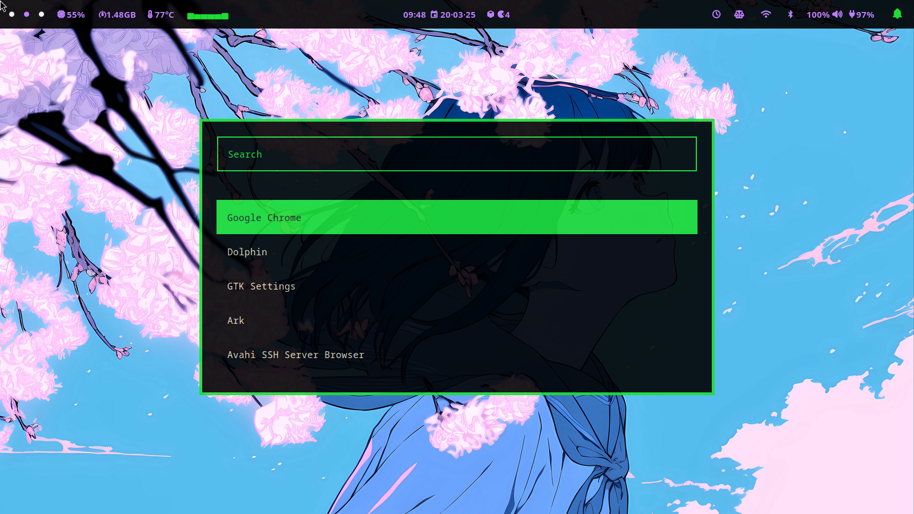
  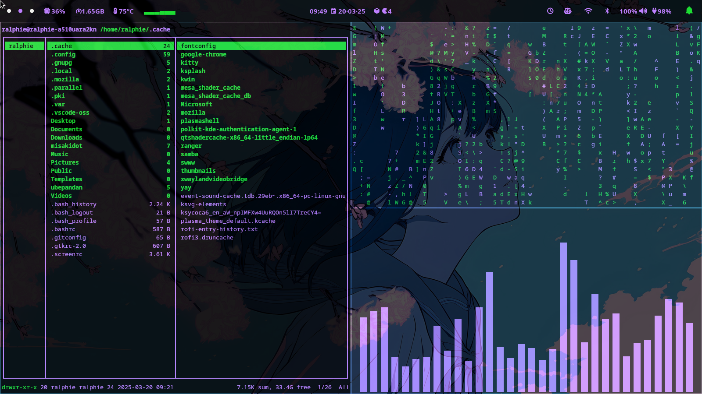
  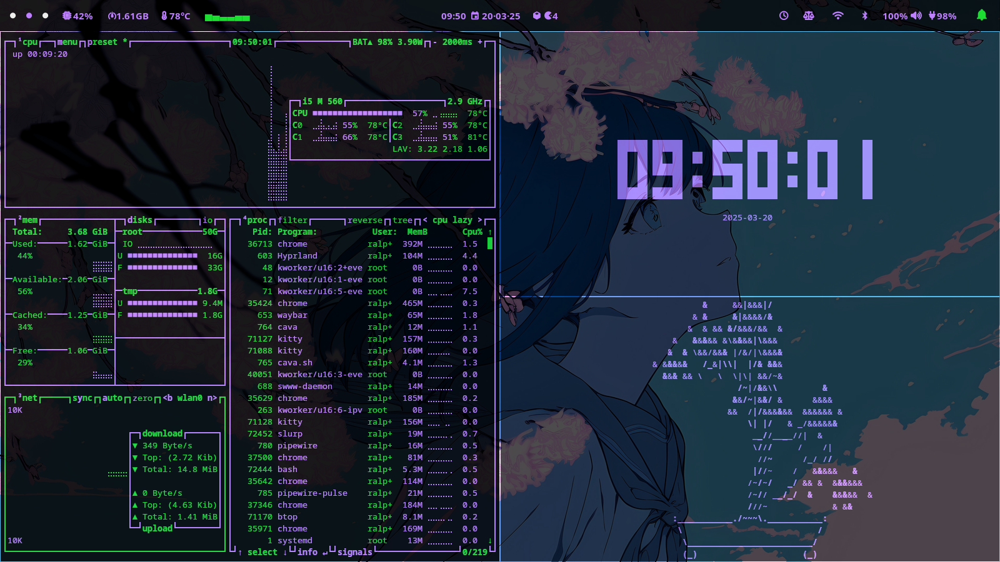
  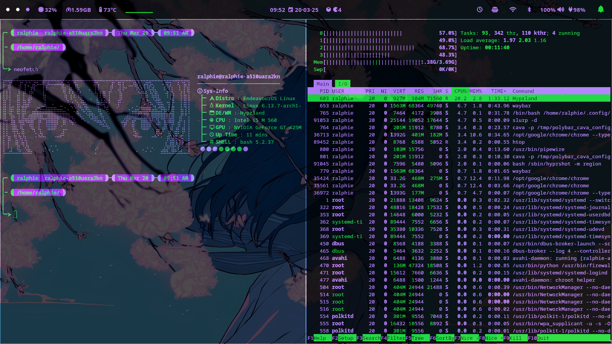
  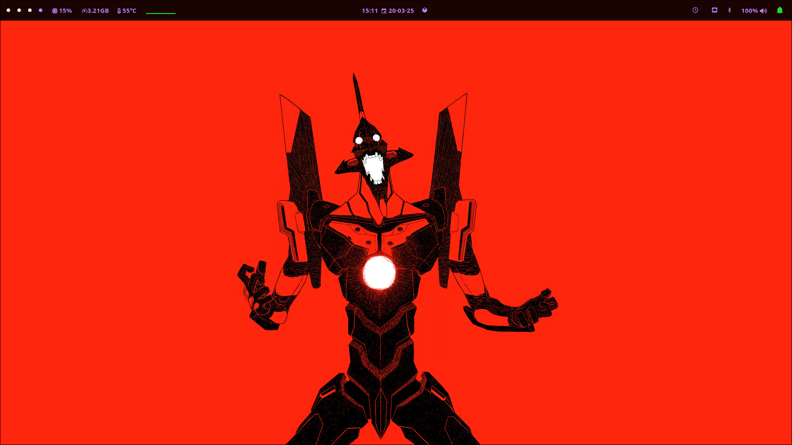
  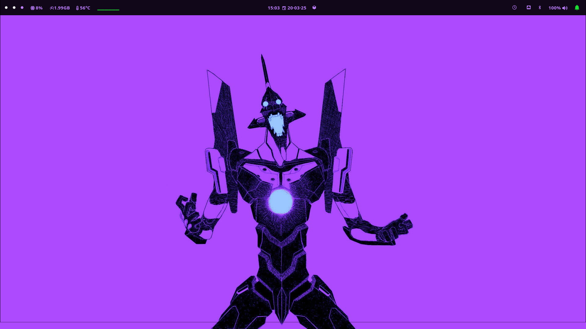
  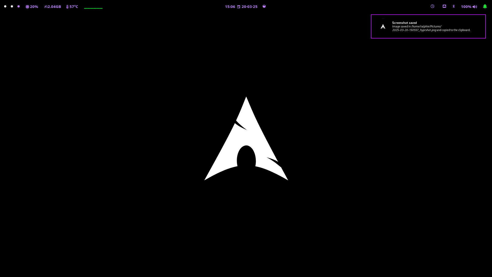
</p>

## ⚡ Installation

Clone the repository and run the installation script:

```bash
 git clone https://github.com/Sumichaaan19/ubepandan.git
 cd ~/ubepandan/scripts
 ./install.sh
```

## 🎨 Theme

This rice is based on the **EVA01** and **JOKER** color themes, including Waybar and terminal colors.

## Notes
- You can always manually install dependencies and copy the config files if the install script doesn’t work properly.
- The install script is optimized for freshly installed Arch Linux.
- If you are using a low-end laptop or want to reduce power consumption, remove the Cava section in `waybar.conf`, as it is a battery hog.

---

This rice is a work in progress, and I'll continue updating it with more tweaks and improvements!

